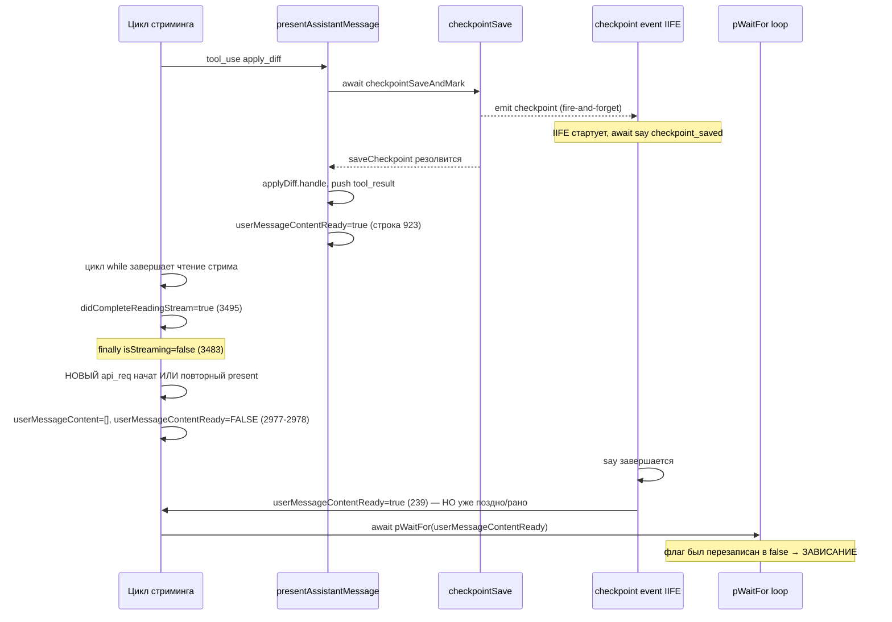
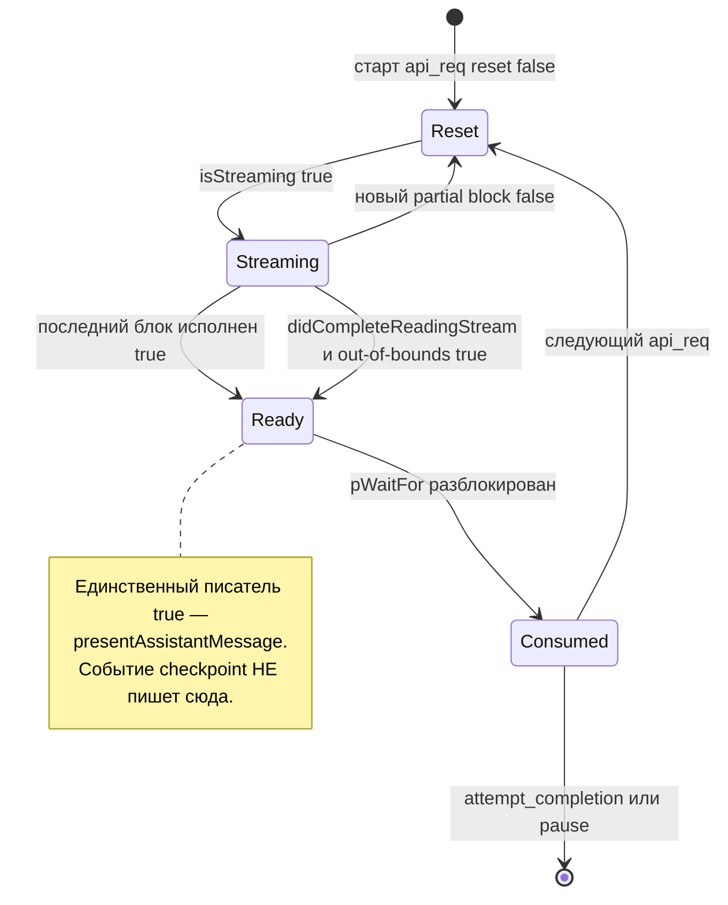

# Архитектурный аудит: Race Condition с `userMessageContentReady` после Checkpoint Save

## 1. Резюме проблемы

Task зависает навсегда на строке [`Task.ts:3762`](src/core/task/Task.ts:3762) (`await pWaitFor(() => this.userMessageContentReady)`), когда происходит определённая последовательность событий вокруг checkpoint save. Симптом — флаг `userMessageContentReady` устанавливается в `true` обработчиком события checkpoint, но затем сбрасывается в `false` в другой асинхронной ветке до того, как `pWaitFor` его проверяет.

Ключевой вывод аудита: **обработчик события `checkpoint` НЕ ДОЛЖЕН управлять флагом `userMessageContentReady`**. Это чужеродная ответственность, внесённая как «CRITICAL FIX», которая на самом деле маскирует другую проблему и сама создаёт race condition. Настоящий владелец флага — [`presentAssistantMessage()`](src/core/assistant-message/presentAssistantMessage.ts:59).

---

## 2. Инвентаризация критических флагов

| Флаг | Владелец (кто ДОЛЖЕН писать) | Где устанавливается в `true` | Где устанавливается в `false` |
|------|------------------------------|------------------------------|-------------------------------|
| `isStreaming` | `recursivelyMakeClineRequests` | [`Task.ts:3012`](src/core/task/Task.ts:3012) перед циклом чтения | [`Task.ts:3483`](src/core/task/Task.ts:3483) в `finally`; [`Task.ts:2611`](src/core/task/Task.ts:2611) в `resumeAfterDelegation` |
| `didCompleteReadingStream` | `recursivelyMakeClineRequests` | [`Task.ts:3495`](src/core/task/Task.ts:3495) после цикла | [`Task.ts:2976`](src/core/task/Task.ts:2976) в начале запроса |
| `userMessageContentReady` | `presentAssistantMessage` | [`presentAssistantMessage.ts:78`](src/core/assistant-message/presentAssistantMessage.ts:78), [`:923`](src/core/assistant-message/presentAssistantMessage.ts:923), [`:941`](src/core/assistant-message/presentAssistantMessage.ts:941) **И (ошибочно)** [`checkpoints/index.ts:239`](src/core/checkpoints/index.ts:239) | [`Task.ts:2978`](src/core/task/Task.ts:2978) + ~8 мест в цикле стриминга |
| `isPaused` | `NewTaskTool` / task loop | [`NewTaskTool.ts:131`](src/core/tools/NewTaskTool.ts:131) | `resumeAfterDelegation` неявно (loop) |
| `abort` | `abortTask` / `resumeAfterDelegation` | [`Task.ts:2442`](src/core/task/Task.ts:2442) | [`Task.ts:2606`](src/core/task/Task.ts:2606) |
| `abandoned` | `abortTask` | [`Task.ts:2439`](src/core/task/Task.ts:2439) | [`Task.ts:2607`](src/core/task/Task.ts:2607) |
| `assistantMessageSavedToHistory` | `recursivelyMakeClineRequests` | [`Task.ts:3726`](src/core/task/Task.ts:3726) | [`Task.ts:2981`](src/core/task/Task.ts:2981) |

---

## 3. Анализ последовательности выполнения (при редактировании файла после checkpoint)

Сценарий из контекста: task хочет **отредактировать файл после checkpoint**. Инструменты редактирования (`apply_diff`, `edit`, `write_to_file`, `edit_file`, `apply_patch`, `new_task`) вызывают [`checkpointSaveAndMark(cline)`](src/core/assistant-message/presentAssistantMessage.ts:957) ДО выполнения самого инструмента.

### 3.1. Два асинхронных пути, которые гонятся

**Путь A — синхронный поток инструмента (внутри `presentAssistantMessage`):**

```
tool_use "apply_diff" 
  → checkpointSaveAndMark(cline)              // await task.checkpointSave(true)
      → checkpointSave() → service.saveCheckpoint()  // ЭМИТИРУЕТ событие "checkpoint"
  → applyDiffTool.handle(...)                 // выполнение, push tool_result
  → (возврат в presentAssistantMessage)
  → userMessageContentReady = true            // строка :923, ЕСЛИ последний блок
```

**Путь B — обработчик события `checkpoint` (асинхронный, fire-and-forget IIFE):**

```
service.emit("checkpoint") 
  → on("checkpoint") handler                   // checkpoints/index.ts:182
      → (async IIFE)
          → await task.say("checkpoint_saved", ...)   // асинхронно, задержки на I/O
          → task.userMessageContentReady = true       // строка :239  ← ЧУЖЕРОДНАЯ ЗАПИСЬ
```

### 3.2. Диаграмма гонки



### 3.3. Почему это происходит НЕ каждый раз

- `checkpointSaveAndMark` защищён флагом `currentStreamingDidCheckpoint` ([`:958`](src/core/assistant-message/presentAssistantMessage.ts:958)) — checkpoint делается **один раз за стриминг**. Гонка возникает только когда событие `checkpoint` реально эмитится (есть изменения в git / `allowEmpty`).
- Обработчик события — **fire-and-forget** `(async () => {...})()` без `await`. Его завершение не синхронизировано с основным циклом. Порядок резолва `say()` (I/O + `postStateToWebview`) относительно основного потока недетерминирован.
- Основной цикл между тем может: (а) завершить чтение стрима → сбросить состояние для нового запроса ([`:2972-2981`](src/core/task/Task.ts:2972)), либо (б) повторно вызвать `presentAssistantMessage`, который сбросит флаг во время обработки следующего блока ([`:3133`](src/core/task/Task.ts:3133) и др.).

### 3.4. Три различимых окна гонки (Race Windows)

| # | Окно | Конфликтующие записи |
|---|------|----------------------|
| RW-1 | Событие `checkpoint` резолвится ПОСЛЕ `pWaitFor`, но флаг уже сброшен новым api-request reset ([`:2978`](src/core/task/Task.ts:2978)) | IIFE `=true` (239) vs reset `=false` (2978) |
| RW-2 | Событие `checkpoint` устанавливает `=true` РАНЬШЕ, чем `presentAssistantMessage` для следующего частичного блока сбрасывает `=false` ([`:3133`](src/core/task/Task.ts:3133)) | IIFE `=true` (239) vs partial reset `=false` (3133) |
| RW-3 | `say("checkpoint_saved")` внутри IIFE вызывает `addToClineMessages`→`postStateToWebview`; если task в это время abort/dispose — запись флага на «мёртвый» экземпляр | IIFE `=true` (239) vs dispose |

---

## 4. Корневая причина

Костыль в [`checkpoints/index.ts:228-239`](src/core/checkpoints/index.ts:228) был добавлен, чтобы «разбудить» цикл после checkpoint. Но:

1. **Нарушение single-writer принципа.** Флаг `userMessageContentReady` имеет чёткого владельца — конечный автомат `presentAssistantMessage`. Второй писатель из несинхронизированного event-обработчика делает состояние недетерминированным.
2. **Ложная предпосылка.** Комментарий утверждает «task hangs waiting for userMessageContentReady». Но `checkpointSave` вызывается синхронно (с `await`) внутри `presentAssistantMessage` ДО выполнения инструмента. Событие `checkpoint` — это лишь UI-уведомление (`say checkpoint_saved` + обновление hash). Оно НЕ является частью протокола завершения стрима и не должно влиять на loop control.
3. **Fire-and-forget без синхронизации.** Даже если запись флага была бы нужна, делать её из неотслеживаемого IIFE — гарантированный источник гонок.

---

## 5. Диаграмма состояний `userMessageContentReady` (целевая, корректная)



---

## 6. Предлагаемое архитектурное решение

### 6.1. Основное изменение (обязательное): убрать чужеродную запись флага

**Удалить** установку `task.userMessageContentReady = true` из обработчика события checkpoint ([`checkpoints/index.ts:228-239`](src/core/checkpoints/index.ts:239)). Обработчик должен отвечать ТОЛЬКО за UI:
- `postMessageToWebview` (`currentCheckpointUpdated`)
- `say("checkpoint_saved", ...)`

Обоснование: `checkpointSave` уже вызывается синхронно (`await`) в потоке `presentAssistantMessage` через `checkpointSaveAndMark`. После его завершения инструмент выполняется, `pushToolResult` наполняет `userMessageContent`, и `presentAssistantMessage` сам корректно выставит `userMessageContentReady=true` на последнем блоке. Событие лишнее для loop-control.

### 6.2. Подтверждение достаточности через сценарии

- **Сценарий «редактирование после checkpoint»:** `apply_diff` → `checkpointSaveAndMark` (await, синхронно) → `handle` → `pushToolResult` → флаг выставит `presentAssistantMessage` штатно. ✅
- **Сценарий `handleWebviewAskResponse` → `checkpointSave(false,true)`** ([`Task.ts:1520`](src/core/task/Task.ts:1520), fire-and-forget при `messageResponse`): здесь checkpoint эмитит событие, но loop в этот момент НЕ ждёт `userMessageContentReady` (task заблокирован в `ask()` на `pWaitFor(askResponse)`, [`Task.ts:1443`](src/core/task/Task.ts:1443)). Значит запись флага была не только вредна, но и не нужна. ✅

### 6.3. Защита от записи на «мёртвый» экземпляр (усиление)

В обработчике checkpoint перед `say()` уже есть проверка `task.abort` ([`:202`](src/core/checkpoints/index.ts:202)). Дополнительно добавить повторную проверку `task.abort`/`task.abandoned` ПОСЛЕ `await say()`, чтобы не мутировать состояние disposed-задачи (устраняет RW-3).

### 6.4. Явный контракт владения (документирование + инвариант)

Ввести единый принцип и зафиксировать его в JSDoc над полем [`userMessageContentReady`](src/core/task/Task.ts:353):

> **Single-writer invariant:** `userMessageContentReady` переводится в `true` ИСКЛЮЧИТЕЛЬНО внутри `presentAssistantMessage`. Любой другой код может только читать флаг или сбрасывать его в `false` в рамках reset нового api-request.

### 6.5. Опционально: защитный `pWaitFor` с таймаутом и диагностикой

Заменить голый `await pWaitFor(() => this.userMessageContentReady)` ([`:3762`](src/core/task/Task.ts:3762)) на вариант с `timeout` и условием выхода по `abort`:

```
await pWaitFor(() => this.userMessageContentReady || this.abort, {
    interval: 50,
    timeout: <разумный предел>,
})
```

Это НЕ основное решение (маскирует, а не лечит), но даёт fail-safe от вечного зависания и логируемую диагностику. Применять только вместе с 6.1.

### 6.6. Сравнение вариантов

| Вариант | Устраняет корень | Риск регресса | Рекомендация |
|---------|------------------|---------------|--------------|
| A. Убрать запись флага из event handler (6.1) | Да | Низкий | **Основной** |
| B. Мьютекс/семафор вокруг флага | Частично (усложняет, не убирает лишнего писателя) | Средний | Отклонить |
| C. `await` события checkpoint в потоке инструмента | Нет (событие и так не нужно для loop) | Средний | Отклонить |
| D. pWaitFor timeout + abort (6.5) | Нет (fail-safe) | Низкий | Дополнение к A |

---

## 7. План тестирования

### 7.1. Unit-тесты `presentAssistantMessage`

- **T1:** tool_use редактирующего файл инструмента как последний блок → после `checkpointSaveAndMark` и `handle` флаг `userMessageContentReady === true`. Мок `checkpointSave` эмитит событие `checkpoint`.
- **T2:** событие `checkpoint` НЕ изменяет `userMessageContentReady` (после удаления записи) — проверка, что при эмиссии события в изоляции флаг остаётся под контролем только `presentAssistantMessage`.

### 7.2. Integration-тест воспроизведения гонки (regression)

Файл: `apps/vscode-e2e/src/suite/checkpoint-edit-race.test.ts` (новый).

- **T3 (воспроизведение):** мок-провайдер, который на первом ассистентском сообщении возвращает `tool_use apply_diff` (изменяющий файл), где `saveCheckpoint` реально эмитит событие `checkpoint` с ненулевой задержкой `say()`. Ассерт: task продолжает loop и переходит к следующему API-запросу в пределах таймаута (нет зависания).
- **T4:** тот же сценарий с `new_task` после checkpoint — убедиться, что делегирование (`isPaused=true`) корректно завершает loop через `return true` ([`Task.ts:3802`](src/core/task/Task.ts:3802)), а не зависает.

### 7.3. Стресс/тайминговые тесты

- **T5:** искусственно варьировать задержку `say("checkpoint_saved")` (0ms / 10ms / 100ms) относительно завершения стрима, повторить N раз. Ассерт: во всех прогонах `userMessageContentReady` разблокирует `pWaitFor`, нет таймаутов.

### 7.4. Assertions-инварианты

- Флаг `userMessageContentReady` меняется на `true` только из стека вызовов `presentAssistantMessage` (проверяется через spy на call stack или отдельный счётчик-обёртку в тестовой сборке).
- После завершения turn с редактированием файла: `pWaitFor` резолвится; `stack` в `recursivelyMakeClineRequests` получает новый item ИЛИ loop корректно завершается.

### 7.5. Как воспроизвести баг ДО фикса

Настроить мок так, чтобы `say("checkpoint_saved")` резолвился ПОСЛЕ строки reset [`:2978`](src/core/task/Task.ts:2978) следующего запроса (внести `await delay` в mock `addToClineMessages`). Ожидаемо: `pWaitFor` на [`:3762`](src/core/task/Task.ts:3762) не завершается → тест падает по таймауту. После фикса (6.1) — проходит.

---

## 8. Итоговые рекомендации по приоритету

1. **[Обязательно]** 6.1 — удалить `userMessageContentReady = true` из обработчика события checkpoint.
2. **[Обязательно]** 6.4 — задокументировать single-writer инвариант над полем флага.
3. **[Рекомендуется]** 6.3 — повторная проверка `abort`/`abandoned` после `await say()` в обработчике.
4. **[Рекомендуется]** 6.5 — fail-safe `pWaitFor` с `|| this.abort` и таймаутом + диагностическим логом.
5. **[Обязательно]** 7.2/7.3 — regression и тайминговые тесты, воспроизводящие гонку.
